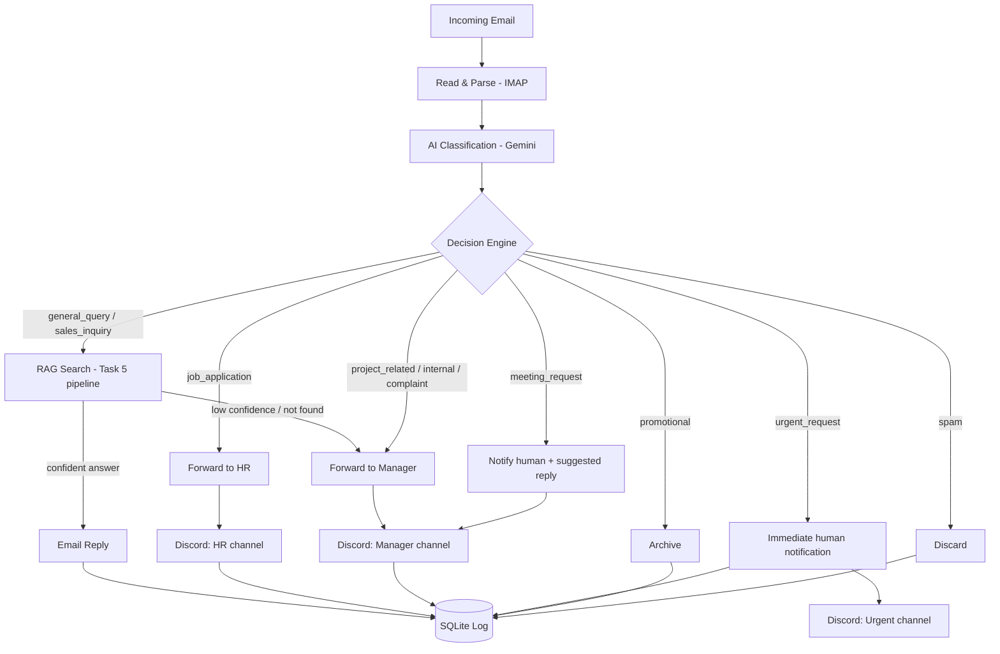

# Task 6 — AI Email Triage & RAG Assistant

DevSynt AI Internship Program — Practical Evaluation Project

## Overview

This system monitors an inbox, classifies every incoming email by intent and priority, and takes the correct automated action:

- Answers general/sales questions using the Task 5 RAG pipeline (grounded in the real-estate knowledge base, no hallucination)
- Forwards job applications to HR with a Discord alert
- Forwards project/internal emails to the Manager with a Discord alert
- Flags meeting requests to a human with a suggested reply (never auto-scheduled)
- Sends an immediate high-priority Discord alert for urgent/critical issues
- Archives promotional email and discards spam, without ever forwarding either to employees

**Core principle:** the AI classifies and routes. It never makes hiring, business, or scheduling decisions — those always go to a human.

## Architecture



## Tech Stack

- **Backend:** Python
- **Email:** IMAP (read) + SMTP (send/forward) — no OAuth setup required
- **AI Classification:** Google Gemini (`gemini-flash-latest`) via the `google-genai` SDK
- **RAG:** Task 5's existing pipeline, reused as-is (see `app/rag.py`)
- **Notifications:** Discord webhooks, one per channel (HR / Manager / Urgent)
- **Logging:** SQLite (`email_log` table)
- **API layer:** FastAPI, for manual triggering and log viewing during the demo

## Project Structure

```
task6_email_triage/
  app/
    config.py            # env var loading
    email_client.py       # IMAP fetch + parsing + SMTP send/forward
    classifier.py          # Gemini classification (category/priority/requires_human)
    decision_engine.py    # routes each email to the correct action
    rag.py                  # bridge into the Task 5 RAG pipeline
    discord_notifier.py    # per-channel webhook alerts
    logger.py                # SQLite logging + duplicate protection
    main.py                  # FastAPI app + background poller
  requirements.txt
  .env.example
  test_report_template.md
  README.md
```

## Setup

1. Copy `.env.example` to `.env` and fill in your values.
2. Install dependencies:
   ```
   pip install -r requirements.txt
   ```
3. Gmail users: enable IMAP in Gmail settings and generate an **App Password** (Google Account -> Security -> App Passwords). Do not use your real account password.
4. Create three Discord webhooks (Server Settings -> Integrations -> Webhooks) for HR, Manager, and Urgent channels, and paste the URLs into `.env`.
5. **RAG is already wired in** (`task5_rag/` at the project root, called directly from `app/rag.py` via a plain Python import -- reuses Task 5's actual retrieval + generation code, not a rebuild). Before testing general_query/sales_inquiry scenarios, build the vector index once from the 5 sample PDFs:
   ```
   python -m task5_rag.ingest
   ```
   This only needs to be run once (or again if you change the source documents). It creates `data/chroma/index.faiss` and `data/chroma/metadata.json`.

## Running

Run continuously (polls the inbox on an interval, and starts the API):
```
python -m app.main
```

Or trigger a single scan manually (useful for demoing test scenarios):
```
curl -X POST http://localhost:8001/process-inbox
```

View the processed-email log:
```
curl http://localhost:8001/logs
```

## Environment Variables

See `.env.example` for the full list: IMAP/SMTP credentials, HR/Manager forwarding addresses, Gemini API key and model, three Discord webhook URLs, SQLite DB path, poll interval, and the RAG confidence threshold used to decide when to escalate instead of auto-replying.

## Classification & Routing Logic

Every email is classified into one of: `general_query`, `sales_inquiry`, `job_application`, `project_related`, `internal_communication`, `meeting_request`, `urgent_request`, `complaint`, `promotional`, `spam`, `other` — along with a priority (`low`/`medium`/`high`/`critical`) and a `requires_human` flag. The full prompt and rules live in `app/classifier.py`. The decision engine (`app/decision_engine.py`) maps each category to its action; any email the classifier fails to parse, or any category not explicitly handled, defaults to a human-review fallback rather than being silently dropped.

## RAG Implementation

Reuses the Task 5 real-estate knowledge base and retrieval pipeline unchanged (see `app/rag.py`). If the retrieved confidence falls below `RAG_CONFIDENCE_THRESHOLD` or nothing relevant is found in the knowledge base, the email is escalated to the Manager instead of getting an auto-reply — the system never fabricates an answer.

## Discord Integration

Three separate webhooks route notifications to the right channel: HR (job applications), Manager (project/internal/complaint/meeting/fallback), and Urgent (critical issues). Each message includes enough detail (sender, subject, reasoning) to act on without opening the email client.

## Limitations

- IMAP polling has a delay of up to `POLL_INTERVAL_SECONDS` between an email arriving and being processed (not truly real-time push).
- Classification quality depends on the LLM prompt; edge cases (e.g. a promotional-looking email that's actually a real client) should be checked against the conservative-deletion rule in `classifier.py`.
- The meeting-request suggested reply is a simple template, not calendar-aware — a human still confirms actual availability.
- Attachments are forwarded as-is; no virus/malware scanning is performed.

## Demo Video

https://drive.google.com/file/d/1RavpoagdfOOoaN-_fyIe6-sdaTDI833i/view?usp=sharing

## LinkedIn Post

[link to be added after publishing — tagging DevSynt's company page]
